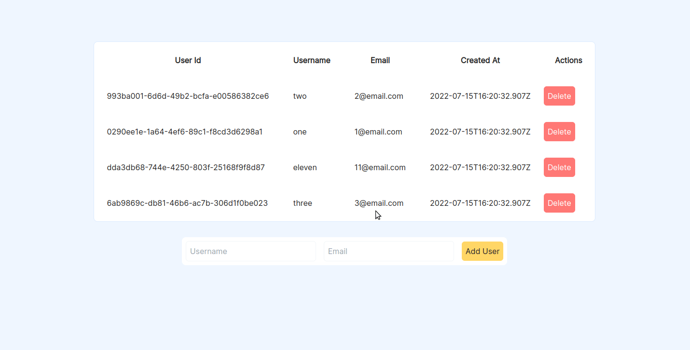

# Haskell Servant + PureScript React with Code Generation :heart:



A demo application showcasing a Haskell Servant server + a PureScript React (`react-basic-hooks`) client with code generation.

Running `/server/codegen.sh` will generate the API types together with a client, visible in [Types.purs](./client/src/GenTypesDemo/API/Types.purs) and [ServerAPI.purs](./client/src/ServerAPI.purs).

To achieve this the project uses [purescript-bridge](https://github.com/input-output-hk/purescript-bridge) and [servant-purescript](https://github.com/input-output-hk/servant-purescript).

# Suggested workflow

This setup enables an extremely productive workflow as it takes very little effort to change things while being confident your client to server communication works properly.

## Add your types and endpoint

```haskell
-- API/Types.hs
...

data User = User
  { id :: UserId,
    info :: UserData
  }
  deriving (Generic)
  deriving anyclass (ToJSON, FromJSON)

data UserData = UserData
  { email :: Email,
    username :: Username,
    created :: CreatedAt
  }
  deriving (Generic)
  deriving anyclass (ToJSON, FromJSON)

... other types omitted for brevity
```

```haskell
-- API/Definition.hs
type UsersApi =
  "users" :> Get '[JSON] [User]
```

## Add the types to `myTypes` in `API/CodeGen.hs`

```haskell
-- API/CodeGen.hs
myTypes :: [SumType 'Haskell]
myTypes =
  [
    genericShow $ equal $ argonaut $ mkSumType @User,
    genericShow $ equal $ argonaut $ mkSumType @UserData,
    ... other types omitted for brevity
  ]
```

## Run `/server/codegen.sh`.

Your types will appear on the client side.

```purescript
-- API/Types.purs
newtype User = User
  { id :: UserId
  , info :: UserData
  }

instance Show User where
  show a = genericShow a

derive instance Eq User

instance EncodeJson User where
  encodeJson = defer \_ -> E.encode $ unwrap >$< (E.record
                                                   { id: E.value :: _ UserId
                                                   , info: E.value :: _ UserData
                                                   })

instance DecodeJson User where
  decodeJson = defer \_ -> D.decode $ (User <$> D.record "User"
      { id: D.value :: _ UserId
      , info: D.value :: _ UserData
      })

derive instance Generic User _

derive instance Newtype User _
```

```purescript
-- ServerAPI.purs
getUsers ::
  forall m.
  MonadAjax Api m =>
  m (Either (AjaxError JsonDecodeError Json) (Array User))
getUsers =
  request Api req
  where
  req = { method, uri, headers, content, encode, decode }
  method = Left GET
  uri = RelativeRef relativePart query Nothing
  headers = catMaybes
    [
    ]
  content = Nothing
  encode = E.encode encoder
  decode = D.decode decoder
  encoder = E.null
  decoder = D.value
  relativePart = RelativePartNoAuth $ Just
    [ "users"
    ]
  query = Nothing
```

## Link the newly generated API operation to your monad stack

```purescript
-- Capability/Users.purs
class Monad m <= MonadUsers m where
  listUsers :: m (Either APIError (Array User))

-- AppM.purs
instance monadUsersAppM :: MonadUsers AppM where
  listUsers = callApi ServerAPI.getUsers
```

You can now use `listUsers` in your application code without duplicating any types or write any custom deserialization logic!

# Known issues/quirks

## Endpoints using `NoContent`

For some reason if you use `NoContent` instead of `()` on your Servant routes the API call will result in a deserialization error on the PureScript side.

## `Required` `QueryParams` don't become required

If you're using any `QueryParams` with `'[Required]`, the PureScript code generation will not pick it up and you'll still have them as optional in `ServerAPI.purs`.

## Haskell `newtype`s with a named field will not deserialize properly

For example if you have something like:

```haskell
newtype Username = Username { unUsername :: Text }
```

this will fail to deserialize. A usable workaround is to define `unUsername` separately like so:

```haskell
newtype Username = Username Text

unUsername :: Username -> Text
unUsername = coerce
```

# What's not shown (yet)

* Authentication tokens
* Handling polymorphic types

# Running it locally

## server

In `./server` (assuming you have `stack` installed)

```
./run.sh
```

## client

In `./client` (assuming you have `yarn` installed)

```
yarn install
yarn run start
```
